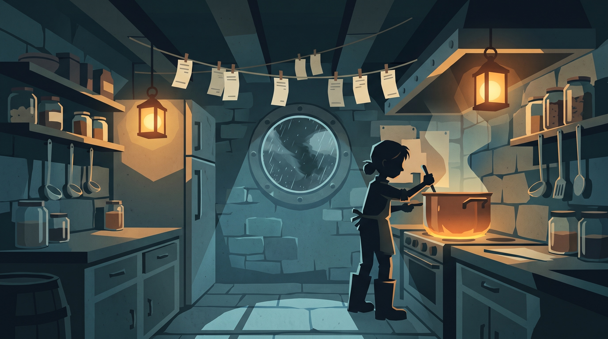
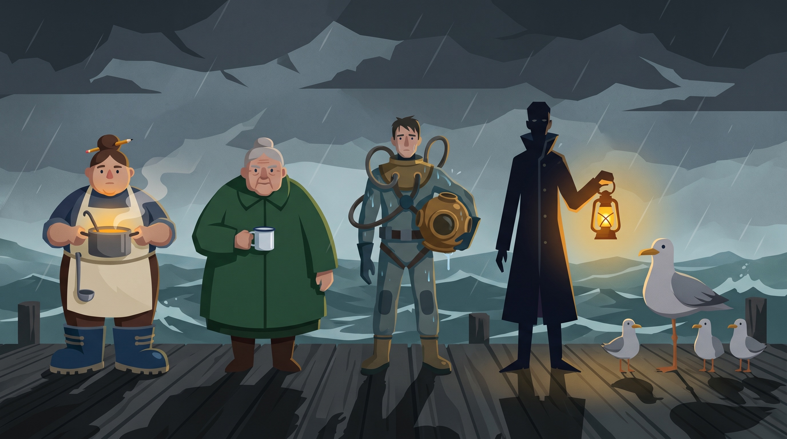
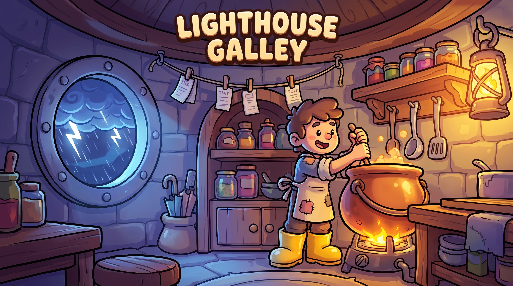
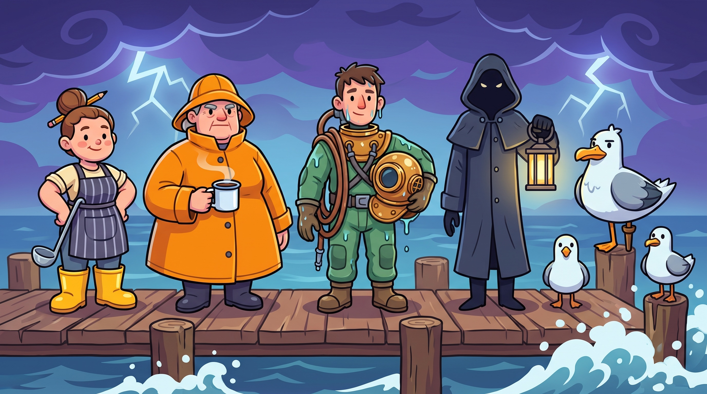
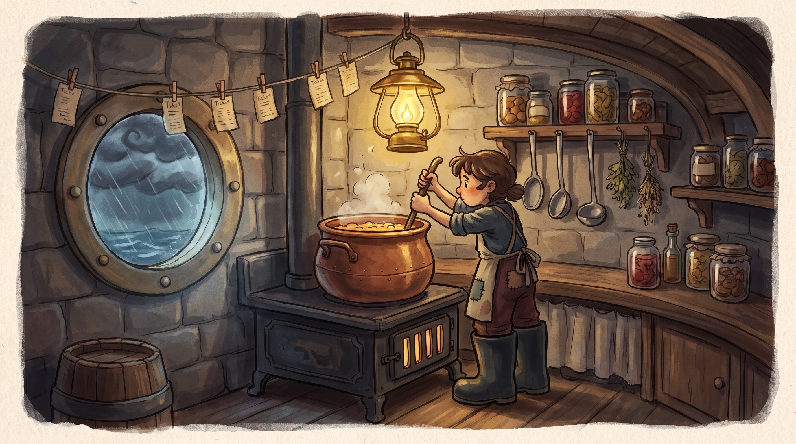
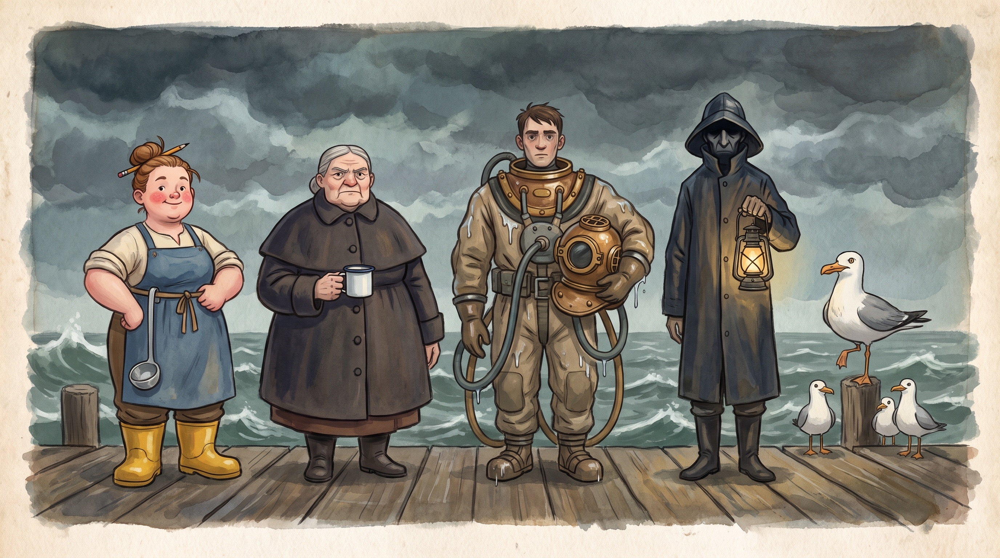
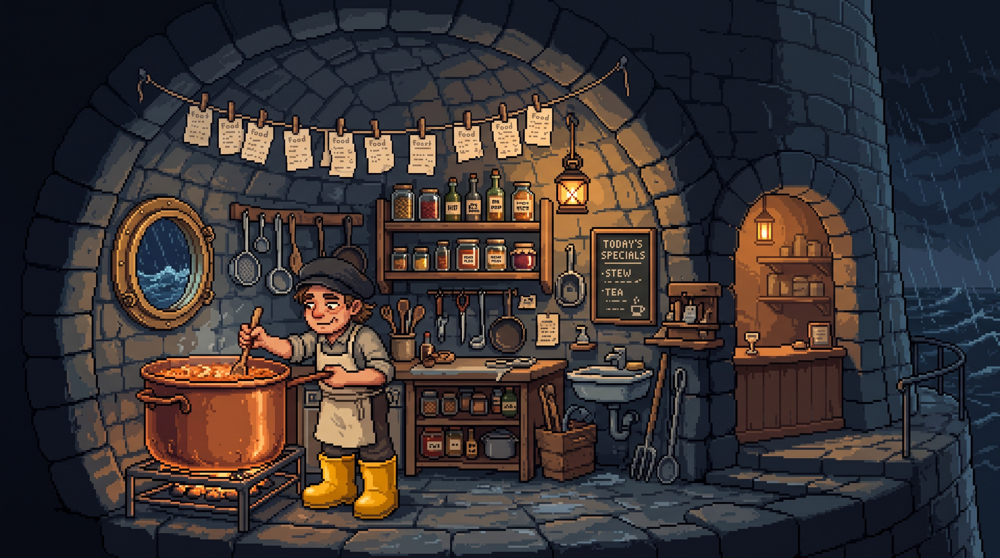
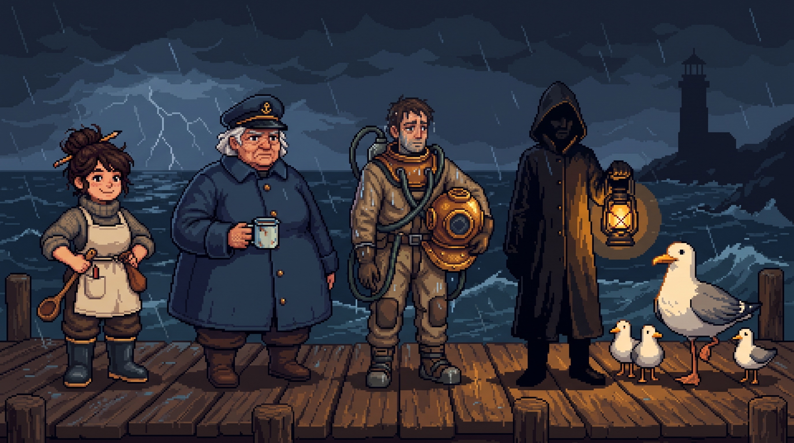

# Kitchen Chaos — 2D Reimagining · Design Doc

**Status: Phase 1 — awaiting approval. No game code exists yet.**
Replaces the Unity-port minigame wholesale (`src/components/minigame/**`). Same name, same idea — cooking under pressure — nothing else carried over.

---

## 0. What carries over, what doesn't

| Carries over | Does not carry over |
|---|---|
| The name **Kitchen Chaos** | Premise, foods, characters, art, mechanics |
| Cooking under pressure as the fantasy | The Unity port's round/judge/theme structure |
| The mount contract (`kitchenGameOpen` → render, `closeKitchenGame` → unmount + camera fly-out) | Everything inside the overlay |
| Camera dive into the Quest 3 + studio boot ident as the entry flow | The emoji-chip DOM presentation |

**Repo reality check** (measured 2026-07-25, HEAD `6b74a3f`): the brief's cleanup targets are mostly already gone. `public/models/{chars,diner,kitchen,restaurant}` and `public/textures/diner` were deleted in the earlier purge commit (~179 MB banked); `public/models/` now holds only the workstation's own 8 GLBs (untouched). The "Atomic Diner" / "Couch-co-op" CSS blocks no longer exist in `src/styles/index.css`. What remains to delete is exactly three files — `KitchenChaosGame.tsx` (745 lines), `kitchen/data.ts` (250), `kitchen/judge.ts` (174) — and the legacy `kitchen-chaos-best` localStorage key. The lazy game chunk measures **10.57 kB gzip** (32.68 kB raw), not ~122 kB; that number predates the purge. All deltas below are reported against 10.57 kB.

---

## 1. The two decisions

### 1.1 Genre — Time-management sim, with cozy-narrative as the single secondary influence

**Primary: time-management sim** (the Papa's Pizzeria skeleton: tickets in, stations worked, quality scored, a clock that doesn't care).

**Secondary: cozy narrative** (Coffee Talk / Night in the Woods), strictly confined to *cast, writing voice, and the between-shift beat* — never pace.

**Dropped: physics puzzler.** Not averaged in — dropped. Its legacy survives only as input feel (flick/drag verbs with weight, one earned physics setpiece in the finale). A level-select physics game is a different shape of game and would cost us the one thing the brief says must survive: cooking under pressure.

**The reconciliation, argued.** The name and the brief fix the fantasy: *cooking under pressure*. Of the three candidate genres, only the time-management sim **is** that fantasy — so the primary pick is forced, and honestly so. The real design question is what the cozy half of the reference list is *for*. The answer: those references get a different job. They supply the cast, the dialogue voice, the warmth — and they live in a different part of the loop (a 30–60 second, skippable, between-shift scene). Service stays frantic 100% of the time; the game runs at two temperatures and never blends them within the same minute. That's reconciliation by structure, not by averaging.

There's a deeper synthesis, and it's the core emotion of the game: **every dish is a tactile little craft that *wants* care (Coffee Talk's layered pours, rhythm chopping), and the ticket line is the pressure that *denies you the time* (Papa's).** Care versus clock. That tension is the skill ceiling, the comedy engine, and the reason the title makes sense. Note that Coffee Talk appears in *both* of the brief's genre lists — it's the hinge reference, and this design takes its mixing hands and leaves its pacing.

One line: **a cozy game about never having time to be cozy.**

### 1.2 Art direction — "Storm-flat": flat stylized moody, with one warm exception rule

**Pick: flat stylized moody** (Night in the Woods' geometry discipline), adapted for food: **cold flat world, hot flat food.** The environment lives in muted storm blues and slates; food, flame, and lantern light are the *only* things allowed the saturated warm band of the palette. Every plated dish reads like the one warm thing in a cold room — which is also the genre thesis ("warmth under weather") stated visually. One idea, top to bottom.

**Shape language rules** (this is the one-artist test, written down):
- No outlines. Forms are hard-edged flat shapes; light is a *shape* of lighter value, never a glow or gradient.
- Two-value shading maximum per surface. Shadows are hard-edged darker shapes.
- Everything sits on a simple ellipse contact shadow.
- Characters built from 2–3 stacked primitives, readable at 48 px tall.
- One global paper-grain overlay at ~5% opacity; nothing else textured.
- One palette, 12 swatches, no exceptions:

| Band | Swatches |
|---|---|
| Storm neutrals | `#1B2430` charcoal, `#2E3D4F` slate, `#46617A` harbor, `#93A7B8` fog |
| Sea greens | `#24463F` deep kelp, `#3E6B5C` tide |
| Warm core (food/light only) | `#F2A65A` lantern amber, `#F4E3C1` chowder cream, `#F7C873` butter, `#D9603B` ember |
| Signals | `#CDE7F0` lightning, `#C24A3F` alert red (tickets/alarms) |

**Why it passes the one-artist test:** every asset is derivable by rule — one shape system, one palette, one grain. A single geometric-flat illustrator could plausibly produce the entire game. It is also, deliberately, the most AI-generation-robust of the four candidates: flat hard-edged shapes regenerate on-style far more reliably than painterly brushwork or strict pixel grids, which directly de-risks the Phase 2 `higgsfield-game-generation` pipeline and its "regenerate rather than ship off-style" rule.

**Why not the others:**
- **Chunky cartoon vector** — reads as casual web/ad game; tonally sunny in a game about storms; the most templated look a portfolio centerpiece could pick.
- **Painterly illustrated** — gorgeous stills, punishing everywhere else: heavy atlases, expensive animation, and per-generation style drift that would fight the asset pipeline on every sprite.
- **Cozy pixel** — real charm, worst mechanics: fullscreen desktop overlay means either giant chunky pixels or letterboxing (integer-scale constraints vs. arbitrary viewports); AI pixel output is notoriously grid-dirty (cleanup tax per asset); and Coffee Talk's identity is strong enough that the game would read as homage, not its own thing.

**Weather is a palette, not a particle count.** The barometer drives five global tint states (Fair → Fresh → Squall → Gale → Century). In Canvas2D that's a cheap composite pass; in this art style it's most of the drama. Art direction and tech shake hands here — see §9.

---

## 2. Premise & setting

**The Gale** is a six-stool galley café bolted to the base of **Wrack Point Light**, a lighthouse on a rock in a busy, badly-behaved shipping lane. Last hot meal before open water; first hot meal after surviving it.

You are **June Salt**, who inherited the place a week ago from her great-aunt **Perpetua ("Pet") Salt** — a cook of local legend — along with Pet's recipe journal, half-dissolved by seawater. It is the first week of **storm season**.

Why it's chaotic, diegetically and permanently: the weather arrives on the barometer's schedule, not yours; the ferry disgorges a dining room's worth of customers in one wave; the lighthouse Keeper upstairs orders by dumbwaiter and will not be seen; the seagulls are organized; and the only recipes worth cooking must be deciphered mid-service from water-damaged pages. The kitchen isn't chaotic because a difficulty slider says so — it's chaotic because it's a tiny warm room in the wrong place, during the wrong season, and everyone needs feeding anyway.

Tone: dry, warm, a little strange at the edges. The storm is never menacing to people — it menaces *soup*.

---

## 3. Cast

| # | Character | Role | Personality (one line) | Silhouette |
|---|---|---|---|---|
| 1 | **June Salt** — *the player* | New cook, sole staff | Outwardly unflappable; internally narrating the disaster in real time. | Small and round; storm boots half her height; bun skewered with a pencil; ladle holstered like a cutlass. |
| 2 | **The Keeper** | Upstairs recluse, orders via dumbwaiter | Communicates only in dumbwaiter notes that get stranger as the pressure drops. | Never fully seen — a shadow across the skylight; one oilskin sleeve in the dumbwaiter hatch. |
| 3 | **Captain Alba** | Ferry captain, regular | Chronically ten minutes early and certain you already know her order. | Square as a sea chest; coat like a ship's bell; enamel mug fused to one hand. |
| 4 | **Moss** | Deep-sea salvage diver, regular | Talks like sonar pings — brief, spaced, unexpectedly kind. | Round brass helmet under one arm; hoses looping like spilled spaghetti; a permanent puddle. |
| 5 | **Bosun & the Wingmen** | Gull syndicate, antagonists | A one-legged gull patriarch collecting what he calls "the crumb tax." | One enormous gull; behind him, a wedge of identical smaller ones. |

Every cast member is load-bearing: the Keeper is a ticket *type* (dumbwaiter orders with strange constraints), Alba is a memory mechanic ("the usual???"), Moss is the unlock economy (pays in seabed finds), and the gulls are a chaos system (§7.3). Nobody is set dressing.

---

## 4. Food

The menu is **storm food** — maritime, invented, a little wrong in the right ways. The pantry has personality *systemically*: ingredients react to the weather, which welds the food to the chaos design.

**Pantry (9 ingredients):**

| Ingredient | Personality |
|---|---|
| Sea-smoke stock | Broth bottled from morning fog; pours like slow silver. |
| Wrackfish | Flat fish whose markings look like nautical charts; filleted along the "coastline." |
| Grumbling potatoes | Mutter audibly; hop off the board when the barometer falls. |
| Thunder onions | Only make you cry when lightning is near — cutting during storms puffs fog over the board. |
| Glasskelp | Translucent ribbons; shatter-crisp when pickled. |
| Butterstone | Butter hard as flint; must be shaved, never spread. |
| Stormflour | Rises only in bad weather — dough proofs *faster* as chaos climbs. |
| Brinecherries | Sour little depth-charges. |
| Lightning brine | Charged pickle liquor; glows for a while after each strike. |

**Launch menu (6 dishes):**

| Dish | Build | Verbs exercised | One-liner |
|---|---|---|---|
| **Ninefathom Chowder** | Sea-smoke stock + grumbling potatoes + wrackfish + butterstone shavings | Chop · Pour · Stir | Nine fathoms deep; the spoon stands up on its own. |
| **The Fogcutter** | Three poured layers: lightning brine, sea-smoke tea, cream cap | Layered pour + settle timing | Required by harbor law before a night crossing. |
| **Squall Rolls** | Stormflour dough + thunder-onion jam | Fold-slap rhythm · Flip | The dough only cooperates when the weather doesn't. |
| **Lightning Pickles** | Glasskelp + brinecherries in a charged jar | Lid-pop timing on the thunderclap | The only dish that *improves* during storms. |
| **Wreck Platter** | Wrackfish filleted along a moving guide line, pickles, half a roll | Precision drag-cut · Flip | The knife-skills showcase; the fish's chart-lines are the cutting guide. |
| **The Keeper's Black Toast** | Stormflour loaf toasted just past burnt + butterstone shaved over hot | Hold-toast · Shave | Only he orders it. The correct moment to stop is *after* the panic. |

Menu starts at Chowder only; the other five unlock through Pet's journal (§8). Six dishes from nine ingredients keeps the pantry learnable and the sprite set honest.

---

## 5. Core loop

### Second to second (service)
Read the next ticket pegged to the **order line** (a real clothesline above the pass; it sways). Pull ingredients from bins. Work 2–4 verb-steps per dish across four stations — **board** (knife work), **stove** (pot/pan), **kettle** (pours), **jar shelf** (pickles) — then plate at the **pass** and ring the bell. Keeper tickets go up the **dumbwaiter** instead, via crank. All the while: watch the **barometer**, and spend seconds you don't have on defense — batten the shutter before a gust, mop the leak puddle, shoo a gull — or pay for ignoring it. The whole game is deciding which careful thing to do sloppily.

### One run = one shift ≈ 3.5–4 minutes
Fixed dramatic arc, not a flat spawner: quiet open (2 gentle tickets) → ferry wave (the crowd hits at once) → a weather cell passes over mid-shift (chaos burst) → last-call push → **Shift Report**. 8–14 tickets depending on the day. A portfolio visitor who plays exactly one shift sees the entire idea in under 4 minutes; that is deliberate.

### Between shifts (the cozy beat, 30–60 s, skippable)
One regular stays while you close up. You choose who gets the day's **leftover special** — that character's 5-beat story advances one beat, and finishing a story earns their **favor** (§8). This is the Coffee Talk influence, quarantined where it can't dilute service. Then the journal page for tomorrow, then lights out.

### A full session
**Storm Season** = 7 shifts, Monday's drizzle to Sunday's **Century Gale** (§7.5), ~30–35 minutes to credits including scenes. After credits: **Storm Season+** (endless, stacking modifiers). First shift is fully representative; the season is there for people who stay.

---

## 6. Verbs

Every verb is one pointer gesture — mouse and thumb are the same gesture at different sizes. No keyboard required, no multitouch required. Hitboxes ≥ 48 px. **Universal fallback:** every drag verb also works as *tap item → tap destination* (motor-accessibility and one-handed portrait play).

**Cooking verbs**

- **Grab & carry** — *Mouse:* drag ingredient/plate to a station or the pass. *Thumb:* same drag; carried item lifts above the fingertip so it's never occluded.
- **Chop** — *Mouse:* drag the knife across the item in short strokes, alternating direction; a steady tempo cuts clean, frantic scrubbing cuts ragged (quality hit). *Thumb:* same back-and-forth swipe over the board, wider lanes.
- **Pour** — *Mouse:* press-and-hold on the vessel to tip it — the longer the hold, the steeper the tilt; release inside the marked fill band. *Thumb:* identical hold; the fill band fattens on touch. Overfill spills onto the counter (spills are a chaos surface, §7.4). The Fogcutter chains three pours with a settle-shimmer pause between layers.
- **Stir** — *Mouse:* circle the pot rim; a ghost-spoon shows target tempo; matching it builds the "body" meter. *Thumb:* thumb-circles, radius forgiving.
- **Fold & flip** — *Mouse:* two downward slap-folds on the dough in rhythm, then a quick upward drag to flip; the pan shimmer marks the timing window. *Thumb:* two down-swipes, one up-swipe.
- **Shave** (butterstone) — *Mouse:* short angled flicks off the stone's edge; each flick lands one curl. *Thumb:* identical flicks; curls land where the dish is.
- **Hold-toast** (Keeper only) — *Mouse & thumb:* press and hold the loaf against the stove; the char meter climbs, the "safe" cue panics at you, and the correct release is a beat *after* it. One verb, one joke, his whole character.

**Defense verbs**

- **Batten** — *Mouse:* grab the shutter tab and pull down across the window, hold the latch a half-beat. *Thumb:* same pull-down, generous latch zone. Costs ~1.5 s and dims the daylight; skipping it before a gust costs more (§7.2).
- **Mop** — *Mouse:* three scrub strokes over a puddle. *Thumb:* three swipes. Breaks the mess cascade (§7.4).
- **Shoo** — *Mouse:* rapid clicks on a gull before it grabs. *Thumb:* rapid taps. Every shooed gull raises Bosun's grudge (§7.3).
- **Crank** (dumbwaiter) — *Mouse:* small circles on the crank to send the Keeper's order up. *Thumb:* same circles. If circling tests poorly on small phones, this degrades to press-and-hold (pre-declared cut, §11).

**Portrait layout:** stations arrange in a 2×3 grid; the active station zooms to fill the lower two-thirds (thumb zone); the order line collapses to a top strip; drag distances shorten accordingly. Landscape keeps the whole galley on screen at once.

---

## 7. Chaos

The title system. Design contract first, content second.

### 7.0 The rules
1. **Telegraphed.** Nothing lands without a readable warning: the barometer trends before every event, and each event has its own tell (§ below). Mastery = reading the room, not reflex-testing.
2. **Answerable.** Every event has a verb response *and* a survivable ignore-cost. There are no instant fails.
3. **Cascading, not random-punishing.** Mess begets mess through legible chains; the skill is breaking the chain early.
4. **Funny when it lands anyway.** Failure produces *content* — a chowder wearing a seagull, a rain-smudged ticket that's now a "mystery order" — never just a number going down.
5. **Chaos taxes attention; it never silently deletes progress.** Worst case, work converts into recoverable mess.

### 7.1 The Barometer
A real instrument on the wall, always visible, always honest. The needle forecasts the next ~30 seconds; its five zones drive the global palette state (§1.2) and the event tables. Learning to glance at it is the game's first invisible tutorial.

### 7.2 The Weather Deck (three events, deep, not broad)
- **Gusts.** Tell: the order line flutters and the window whistles (plus an icon cue — no audio-only tells). Battened: rattle, nothing more. Unbattened: tickets tear off the line and fly — catch each mid-air within ~2 s or it lands smudged and rewrites itself into a harder-to-read "mystery ticket" (you can still serve it; you just have to *deduce* it). Light loose items scatter to the floor.
- **The Leak.** Tell: a ceiling drip ring darkens over one random station. Answer: slide any pot under it — which *occupies that pot*, a real cost — or mop later. Ignored: a puddle forms and grows; drags that cross it gain slippery inertia (carried items overshoot).
- **Lightning.** Double-edged by design: every strike charges the pickle jars (Lightning Pickles get better, lightning brine glows) *and* fogs any thunder onion mid-chop *and*, at Gale+, kills the lights for ~1.5 s — the galley drops to silhouettes and lantern glow. The art direction's favorite moment; reduced-motion users get a dimmed-palette state instead of a hard cut.

### 7.3 The Gull Syndicate
Systemic pressure, not a spawner: raid intensity keys to **exposed food** — plates idling at the pass, ingredients left on the sill. Tell: gull shadows cross the window first. Answer: shoo (fast, raises the **grudge ledger**) or serve/cover food promptly (slow, structural). Bosun himself only appears for premium dishes and cannot be shooed by tapping — he must be *paid* (sacrifice one roll to the crumb tax) or out-waited. The grudge ledger pays off in the finale's authored **gull heist** setpiece. The gulls are the only chaos system the player's own tidiness can nearly silence — that's the lesson they teach.

### 7.4 The Mess Cascade
Spill → puddle → slippery drags → dropped food → gulls → feathers in the chowder. Every link is visible, every link has a breaker verb (mop, cover, shoo), and the cascade is the *reason* defense verbs earn their screen space. One chain, fully legible, learned by shift 3.

### 7.5 The escalation calendar (chaos as authored episodes, not a curve)
| Shift | Forecast | What's new |
|---|---|---|
| Mon | Drizzle | Chowder only; one polite telegraphed gust; Alba introduces "the usual." |
| Tue | Fresh breeze | Fogcutter unlocks; first leak; gull scouts case the pass. |
| Wed | Squall | Squall Rolls; gust waves; the Keeper's notes turn strange. |
| Thu | Chop | Lightning Pickles; first blackout beat; storm-charged jars. |
| Fri | Gale | Wreck Platter; Bosun appears; cascade fully armed; double ferry wave. |
| Sat | Storm | Full menu incl. Black Toast; two weather cells; the gull heist. |
| Sun | **The Century Gale** | Authored finale: rolling blackouts (cook by lightning flash and lantern), the room *tilts* on the biggest swells — the one earned physics-comedy beat in the game — the Keeper's final order, and the lifeboat crew to feed at the end of it. |

Difficulty rises because the *situations compound*, not because timers shrink. That's the difference between a chaos design and a difficulty curve.

---

## 8. Progression

- **Shift Report, in forecast language.** Your grade is the weather you leave behind: *Clear Skies* (flawless) → *Fair* → *Passing Squalls* → *Small Craft Advisory* (rough shift). Sub-scores: tickets served, craft quality (clean cuts, layer accuracy, body meter), chaos handled (cascades broken, tickets caught). Grades persist; chasing Clear Skies across all seven shifts is the score game.
- **Pet's journal.** One water-damaged page recovers per shift → next dish unlocks. Pages are *partially* legible, so the first cook of any new dish is live deciphering — a designed discovery moment, and the tutorializer (the page literally shows the verb glyphs you can read, and you infer the rest). A few bonus pages unlock only through chaos feats (e.g., *cook any dish start-to-finish during a blackout*), which seeds second-run goals.
- **Regulars' stories & favors.** The between-shift leftover choice advances one character's 5-beat arc; a season has room to finish ~2 of 4. Completing an arc grants a **favor**, chosen pre-shift (one slot): Alba radios the ferry to stagger the wave; Moss dives up a second mop-bucket (puddles auto-drain once); the Keeper aims the beam to burn off onion fog once per shift. Favors are the replay loadout.
- **Storm Season+.** Post-credits endless week with stacking modifiers (two weather cells, proud gulls, brittle jars). Leaderboard-less by design; the chase is your own forecast history.
- **Why a second run happens:** unfinished character arcs (structurally can't see all four in one season), chaos-feat journal pages, Clear Skies sweeps, Storm Season+.
- **Persistence:** `localStorage` under `kc2:*` (grades, unlocks, story flags, mute). Legacy `kitchen-chaos-best` key deleted at M5.

---

## 9. Tech

### Renderer — Canvas2D world + thin DOM overlay (decided against the art direction, not in the abstract)

| Option | For | Against | Verdict |
|---|---|---|---|
| **Canvas2D** | One draw loop absorbs rain particles, 20-gull mobs, screen shake, and the palette-tint weather states (a single composite pass — exactly what §1.2 needs); sprite-atlas batching; predictable 60 fps on mobile Safari; DPR-crisp flat shapes | Text/a11y needs help; hand-rolled hit-testing (fine — stations are rects/circles) | **Play space** |
| Layered DOM | Free a11y and text; CSS anims; fastest to start | Hundreds of animated nodes jank on mobile; global palette shifts = repaint storms; gesture verbs fight selection/scroll; reads as "website," and the brief says "real indie game" | Rejected for world |
| SVG | Matches flat-vector aesthetic; resolution-independent | Node-bound animation and filter cliffs at our particle/mob counts | **Asset authoring format only** — flat shapes author beautifully as SVG, rasterized into the atlas at build/load |

**Hybrid split:** the galley, food, weather, and gulls live on canvas; tickets, the journal, menus, and dialogue live in a DOM overlay — crisp text, real focus order, screen-reader labels, selectable nothing. Pointer events unified across both.

### Structure & integration (the contract, verbatim from HEAD)
- Mount: `kitchenGameOpen` boolean + `openKitchenGame`/`closeKitchenGame` in `src/store/store.ts:29-131`; lazy `<Suspense>` mount in `src/app/App.tsx:96-100`. Unchanged.
- Entry: Quest 3 click → camera dive (`src/components/Experience.tsx:278`) → studio boot ident → **title card** ("THE GALE — first shift of storm season"), skippable.
- While open: R3F frameloop stays `'never'` (`src/components/Experience.tsx:458`) — the 3D scene fully pauses behind the game. Keep exploiting this.
- ESC: owned by the game while mounted (`src/app/App.tsx:79` guard) — pause menu first, quit to workstation second, exactly one camera fly-out.
- Fullscreen overlay owns the screen and ships its own palette; it never reads workstation theme presets.
- New code in `src/components/game/` (fresh directory); `src/components/minigame/**` deleted at M5 when nothing references it.

### Asset pipeline
`higgsfield-game-generation` skill → sprites/spritesheets/tileables → packed **WebP atlas + `manifest.json`** committed under `public/game/kitchen-chaos/` (new directory). The loader fetches and `decode()`s the core atlas *during the camera dive + ident* (~2.5 s of already-owned screen time), so the title card lands with zero pop-in. Per-shift extras (finale set pieces, story portraits) lazy-load between shifts. Off-style generations get regenerated, not shipped.

### Budgets (reported at every milestone)
- Code: **≤ 45 kB gzip target, 60 kB ceiling** for the lazy chunk (baseline today: **10.57 kB**; expected delta ≈ +30–45 kB, all of it game). Zero new runtime dependencies — game logic is vanilla TS on rAF; React only frames the shell/DOM overlay.
- Art: core atlas ≤ 600 kB; total committed game assets ≤ 1.5 MB. (For scale: the old 3D game's asset folders were ~179 MB before the purge; that win is already banked at HEAD, and this design never re-spends it.)
- Runtime: steady 60 fps on a mid-tier phone; zero long tasks > 50 ms during service.

### Mobile, motion, audio
- Portrait-first touch layout (§6); all verbs single-pointer; 48 px minimum targets; tap-tap fallback for every drag.
- `prefers-reduced-motion`: no shake, no line-sway, no rain particles, no blackout hard-cuts — replaced by static overlays, palette states, and icon cues. Every chaos tell already has a non-motion equivalent by rule.
- No audio before user interaction: WebAudio unlocks on the first in-game pointer-down, never on mount. Small SFX set + one ambience loop; mute persisted in `kc2:settings`.

---

## 10. Milestones (each independently playable)

| # | Name | Contents | Playable check |
|---|---|---|---|
| **M0** | Dry Dock | New `src/components/game/` mounts on the existing contract; virtual-resolution canvas scaler (1280×720 ⇄ 720×1280); unified pointer input; placeholder shapes; one-ticket chowder loop; ESC/pause/quit | Serve 5 chowders, see a score, quit cleanly. Chunk delta reported. |
| **M1** | Service | Chowder + Fogcutter + Squall Rolls; all cooking verbs; order line, shift clock, ferry wave; Shift Report; portrait layout + tap-tap fallback | One full 3.5-min shift, graded, on desktop and phone. |
| **M2** | Weather | Barometer + palette states; gust/leak/lightning; batten/mop; mess cascade; reduced-motion paths | The same shift under weather — the title earns itself here. |
| **M3** | The Regulars | Gull syndicate + grudge; Keeper dumbwaiter tickets + notes; Alba's "usual"; Moss's finds; between-shift scene with one full story arc; audio (post-interaction) | A shift where every pressure has a face; one arc completable. |
| **M4** | Storm Season | 7-shift week; journal unlock flow (full 6-dish menu, partial-page deciphering); favors; Century Gale finale; Storm Season+; persistence; second story arc | Season start-to-credits; Season+ loops. |
| **M5** | Ship & Sweep | Full generated asset set in `public/game/kitchen-chaos/`; polish (juice, transitions, title card); QA matrix (touch/portrait/reduced-motion/Safari); perf pass; **delete `src/components/minigame/**` + legacy storage key**; final bundle report vs 10.57 kB baseline; end-to-end gameplay screenshots | The done-means bar: full session verified in-browser, screenshots of real play, cuts reported. |

---

## 11. Risks & pre-declared cuts (first to die, in order)
1. Fourth regular's story arc → ships post-launch (season still structurally complete with two).
2. Storm Season+ modifiers → post-launch (credits remain the finish line).
3. Fogcutter settle-physics → simplifies to a timing bar if the shimmer feels mushy.
4. Dumbwaiter crank-circles → press-and-hold on small phones if circling tests poorly.
5. Blackout silhouette-cooking duration → shortened if readability fails on 375 px screens.

What is *not* cuttable: the barometer, the three weather events, the gulls, the cascade, portrait play, reduced-motion parity. Those are the game.

---

## 12. Moodboards (Higgsfield)

**Method:** the same two subjects rendered in all four candidate directions, so the comparison is honest — (S1) the galley interior mid-storm, (S2) the five-character dock lineup. Two images per direction, eight total, to `docs/kitchen-chaos-2d/`.

**Status: generated 2026-07-25.** Model `nano_banana_2` (backend routed each job to Nano Banana Pro), 2752×1536, stored as JPEG q85 — eight files, ~8.9 MB total.

### Direction B — flat stylized moody · **the recommendation**

The §1.2 rules emerged on the first generation with no retries: cold slate world, warmth confined to lanterns and food (June's pot is literally the warm object in both frames), hard-edged shapes, no outlines, the Keeper holding as a pure silhouette. This is the game.

### Direction A — chunky cartoon vector

On-style and self-incriminating: sunny, outlined, toy-like — the galley shot even inserted its own splash-screen title text unprompted. This style *wants* to be a casual-game ad, which is the objection §1.2 raises.

### Direction C — painterly illustrated

The most beautiful stills of the set — and every square inch is hand-rendered texture, which is precisely the animation-volume and regeneration-consistency cost the doc flags. Right style for a book; wrong style for 14 tickets a shift.

### Direction D — cozy pixel

The honest runner-up: real charm, great mood. Two liabilities visible even at moodboard distance — the pixel grid drifts (mixed pixel densities across surfaces, the known AI-pixel cleanup tax), and the register reads as Coffee Talk homage rather than an own identity.

**Cross-style observation:** the five-character cast brief survived all four style transfers recognizably — pencil-bun cook, bell-coat captain, dripping diver, silhouette Keeper, gull mob. The silhouettes are strong independent of rendering style, which is what §3 was designed for.

**Prompts of record (for regeneration):**
Subject S1: *"Interior of a tiny one-cook galley café built into the stone base of a lighthouse: one round porthole showing dark storm rain, a small cook in huge rubber boots stirring an oversized copper pot, paper tickets pegged to a swaying clothesline, warm lantern light against cold blue shadows, shelves of jars, hanging ladles — wide 2D game concept art."*
Subject S2: *"2D game character-design lineup on a wooden dock in front of a stormy sea, five figures full-body, evenly spaced: a small round young cook in enormous rubber storm boots with a pencil-skewered hair bun and a big ladle holstered on her belt; a huge square old ferry captain woman in a bell-shaped coat holding an enamel mug; a salvage diver holding a round brass diving helmet under one arm, dripping wet, air hoses looping around the body; a tall thin lighthouse keeper as a near-silhouette in an oilskin coat holding a lantern; one large one-legged seagull flanked by three identical smaller gulls."*
Style suffixes: A *chunky cartoon vector, thick clean dark outlines, bright saturated palette, glossy toy-like shading, mobile-game splash art* · B *flat stylized 2D, zero outlines, hard-edged geometric shapes, muted storm palette pierced by warm amber lantern light, strong silhouettes, subtle paper grain* · C *hand-painted gouache, visible brushstrokes, textured paper, muted antique maritime palette, storybook plate mood* · D *cozy detailed pixel art, fine pixel grid, warm dithered lantern lighting, limited palette, crisp sprite work*.

---

## 13. Open taste questions (non-blocking — recommendations included)
1. **How strange is the Keeper?** Recommend: mildly uncanny, never explained, never hostile (notes like *"No crusts. The sea counts them."*). Alternative: purely mundane-eccentric.
2. **Dialogue volume.** Recommend: one-liners during service, ~40 total lines per story arc between shifts. Alternative: longer Coffee-Talk-style exchanges (costs writing + reading time in a 30 s beat).
3. **Menu content check:** invented fish on the menu OK, or keep the menu fully meatless? (Design works either way; Wreckfish → "Wreckroot" swap exists.)

---

*Phase 2 does not start until this document is approved. When it is: milestones run in order, every one ends playable, and the final report includes the bundle delta, the cut list, and in-game screenshots.*
